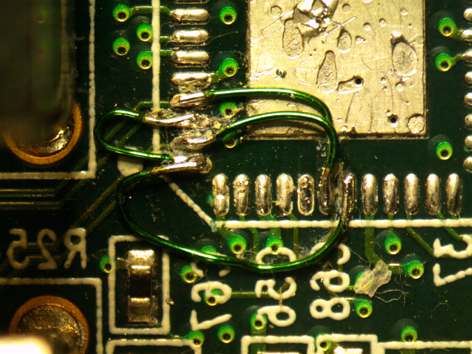
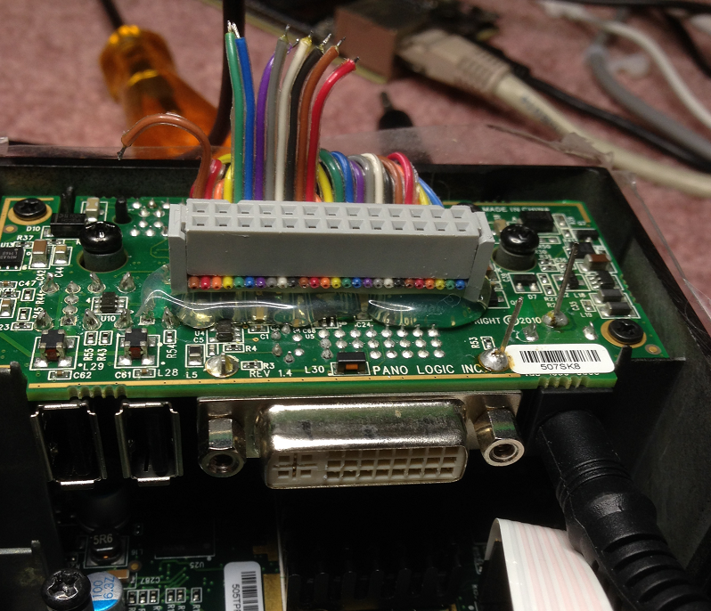
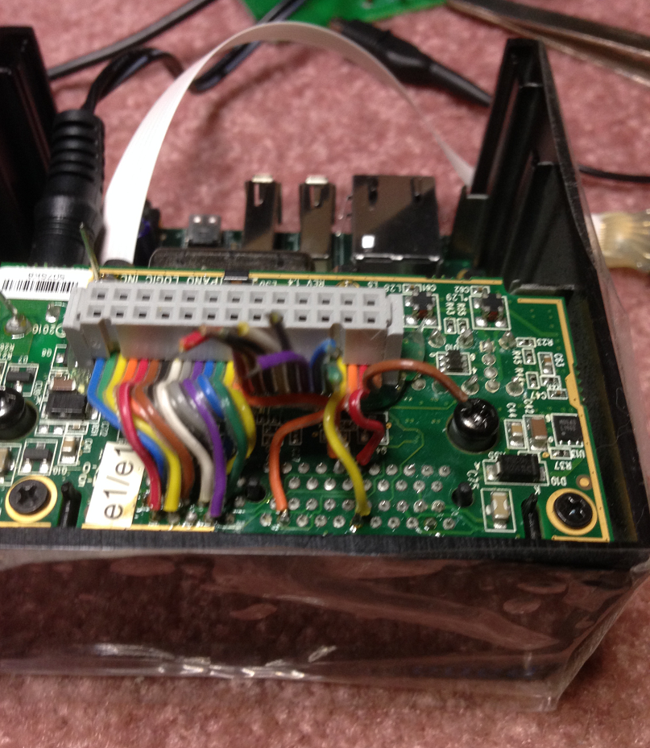
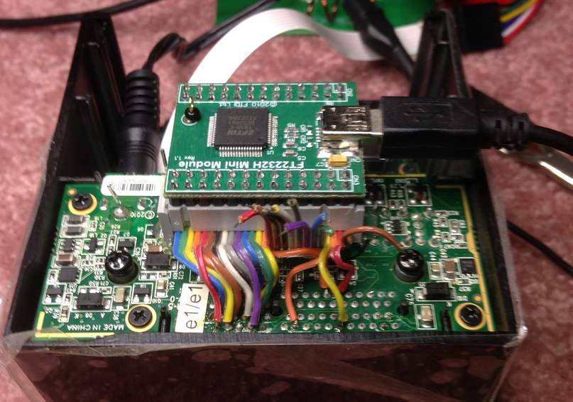

## Panologic based USB 2.0 Sniffer

This is a port of http://github.com/ultraembedded/usb_sniffer to the second 
generation Panologic thin client. 

If you don't know what a Panologic thin client then see [this](https://hackaday.com/2013/01/11/ask-hackaday-we-might-have-some-fpgas-to-hack/) 
article and refer to the links at the bottom of this page for further reading.

## Hardware differences from orignal project.

The usb_sniffer project was originally developed for the miniSpartan6+ board 
interfaced to an external USB3300.  The miniSpartan6+'s FT2232H USB interface 
was used to transfer captured data to a PC.  

The Panologic device is based on a larger device from the same Spartan 6 
family as the miniSpartan6+ and it already has a USB3300.  The Pano device 
doesn't have an FT2232H interface, but it does have gigabit Ethernet.

To speed initial development I added an FT2232H interface to the Pano as an 
interim step. Eventually I am planning on using Ethernet for communications.  

## HW Requirements

* A Pano Logic G2 (the one with a DVI port)
* A suitable 5 volt power supply
* A JTAG programmer to load the bitstream into the FPGA.
* An [FT2232H MINI MODULE](https://www.digikey.com/product-detail/en/FT2232H+MINI+MODULE/768-1030-ND/2027252?utm_medium=email&utm_source=oce&utm_campaign=2981_OCE19RT&utm_content=productdetail_US&utm_cid=298938&so=62036788&mkt_tok=eyJpIjoiTkdNNU0yTXpaV1l6TVdSaiIsInQiOiJYR1wvQWR4NVY5R1dtS0daVFpmRVdkdG1HdGI2dUF0UXRqNG5wVll0QjY1VjFKQWt0VEo3TmprenZmQmFVZENHSDdiMlNPWWxcL3I1YmxsVXdHQzdkU1F0TjZHRTl4UUU2M25NZE9FOVBYOU9Ld0FcL3d1blplN0lqRnJhZVVMNXRBWiJ9)

## HW Modifications

For this project it will be necessary to remove the USB hub chip that is 
between the USB3300 and the USB connectors. Once the hub chip is removed the 
USB3300's USB bus can be connect directly to two of the USB connectors.  
This will make it easy to insert the sniffer between a host and a peripheral.

The modified Pano will also be usable as a USB peripheral by loading 
appropriate HDL and software.

## FT2232H Interface

Initially I didn't think adding an FT2232H interface to the Pano was an viable 
option, however after some further thought I figured out a practical way it 
could be done.  Since we don't need a monitor for the sniffer the video signals
could be repurposed for interfacing with an external FT2322 module.  

Since all of the video signal for the Chrontel DVI transmitter chip must cross 
from the FPGA board to the power board they are all present on the board 
to board connector.  Soldering to the board to board connector is MUCH easier 
than soldering to tiny traces or component leads.  Additionally since only 
input signals to the Chrontel DVI transmitter chip will be needed won't even 
need to remove the chip.  

If you an anxious for an USB sniffer and don't want to wait for the planned
(but not scheduled) Ethernet support here are the connections:

| FTDI   | MiniSpartan6+ | Pano      | board to board | CN3  | ribbon | FPGA |  
|--------|---------------|-----------|----------------|------|--------|------|
|        |               |           | connector pin  | pin  | Color  | pin  |
|        |               |           |                |      |        |      |
| BD0    | FTDI_D0       | DVI_D[1]  |  Inside 3      | 26   | green  | A14  |
| BD1    | FTDI_D1       | DVI_D[0]  |  Outside 3     | 25   | blue   | D17  |
| BD2    | FTDI_D2       | DVI_D[3]  |  inside 4      | 24   | orange | A14  |
| BD3    | FTDI_D3       | DVI_D[2]  |  Outside 4     | 23   | yellow | A16  |
| BD4    | FTDI_D4       | DVI_D[4]  |  outside 5     | 21   | red    | A17  |
| BD5    | FTDI_D5       | DVI_D[6]  |  outside 7     | 20   | white  | D14  |
| BD6    | FTDI_D6       | DVI_D[5]  |  inside 5      | 19   | black  | A18  |
| BD7    | FTDI_D7       | DVI_D[8]  |  outside 8     | 18   | violet | B16  |
|--------|---------------|-----------|----------------|------|--------|------|
| BC0    | FTDI_RXF      | DVI_D[7]  |  inside 7      | 17   | gray   | B14  |
| BC1    | FTDI_TXE      | DVI_D[10] |  outside 9     | 16   | green  | E16  |
| BC2    | FTDI_RD       | DVI_D[9]  |  inside 8      | 15   | blue   | B18  |
| BC3    | FTDI_WR       | DVI_H     |  inside 20     | 14   | orange | F12  |
| BC4    | FTDI_SIWUA    | DVI_D[11] |  inside 9      | 13   | yellow | D15  |
|--------|---------------|-----------|----------------|------|--------|------|
| VCC    |               | +5V       | outside 14     | 3    | yellow |      |
| VIO    |               | +3.3V     | outside 2      | 22   | brown  |      |
| GND    |               | GND       | inside 22      | 2    | brown  |      |
| GND    |               | GND       | outside 22     | 4    | orange |      |
|--------|---------------|-----------|----------------|------|--------|------|

## WARNING WILL ROBINSON !!

When I connected the FT2232H module to the Pano I used "spectrastrip" ribbon 
cable with color coded wires to make identifying the correct wires easier.
Once I had finished the wiring I created simple bit file that generated square 
waves of unique frequencies on each of the interface pins to allow the 
connections to be verified with a scope rather than trying to use an ohm meter.

Knowing the color code and having done used a similar connection schemes many 
time before I knew that pin one would be brown, pin 2 red, etc....  

**WRONG, WRONG WRONG !!!**

For whatever reason the FT2232H module was layed out as if the ribbon cable
connector was soldered to the same side of the board as the FTDI chip, however
the connector is actually on the OPPOSITE side of the board!  This means that
all of the even pins and odd pins of my carefully "verified" connections were
SWAPPED. 

Believe me when I tell you that I was shocked when I literally "let the 
smoke out" of the FT2232H module when I powered it up after I had carefully 
"verified" all of my connections.  The good news is that my Pano survived, the 
FT2232 module not so much.  

When I had "buzzed out" my connections I had intentionally used a pin header
rather than the actual module to play it safe, so much of safety.  Note to
self, ALWAY ohm out at least the power connections to the actual board.

Happily none of the data connections needed to be redone since those could be
fixed by simply editing the .UCF file.  Once the power connections were
straightened out and a new module was connected the magic smoke remained 
inside of the module.

## FT2232H Interface configuration

Surprisingly (at least to me) the FT2232H operation mode is not set simply by 
software it is set by an EEPROM attached to the chip.  Out of the box my 
FT2232H module was programmed for the dual asynchronous serial interface 
mode rather than the required "ASYNC 245 FIFO" mode. I used the [FT_PROG](https://www.ftdichip.com/Support/Utilities.htm#FT_PROG) 
Windoze utility to reprogram the EEPROM for the proper mode.  While I was at
it I edited the manufacture and product strings so my module now identifies
itself as a "Pano" "USB sniffer".

## Building bit file from sources

**NB:** While it may be possible to use Windows for development I haven't 
tried it and don't recommend it.

1. Clone the https://github.com/skiphansen/usb_sniffer repository
2. cd into .../usb_sniffer/fpga/panologic_g2
3. Run Make

## HW Modification details

1. [Disassemble](https://tomverbeure.github.io/pano/logic/2018/12/02/Pano-Logic-G2-Disassembly.html) the Pano.
2. Mask everything around U7 with Kapton tape.
3. Remove the USB hub chip U7 using a hot air gun.
4. Jumper USB data plus pins U7.2, U7.4, and U7.43.
5. Jumper USB data minus pins U7.1, U7.3, and U7.42.

Step 3 is the hardest part by far.  The USB2514 chip has a large thermal ground 
pad on the bottom of the chip which makes it difficult to remove.  A hot air gun
and lots of patience is required.  

I am NOT very experienced with a hot air gun so there may be people who find it 
easy! Additionally my hot air gun is an old ebay special, but it did 
(eventually) get the job done.  

Here's our target:

 

After masking with Kapton tape:

 

After removing it:

 

After cleaning the pads and removing the tape:

 

After adding jumpers:

 

After attaching ribbon cable connector to Pano with hot glue

 

All ribbon cable wires connect to board to board connector pins.
** WARNING this photo was taking prior to correcting my wiring errors described above !!!** 

 

FTDI Mini module attached.

 

## Pano Links

- [Gitter](https://gitter.im/panologic/community) chat room for Panologic hackers.
- Group.io [group](https://groups.io/g/panohackers/topics) for discussions about Panologic hacking 
- [Original Hackaday](https://hackaday.com/2013/01/11/ask-hackaday-we-might-have-some-fpgas-to-hack/) article from 2013.  
- Hackaday article on Tom's [Raytracker](https://hackaday.com/2018/12/07/racing-the-beam-on-a-thin-client-in-fpgas/).  
- Hackaday article on my [Pacman](https://hackaday.com/2019/01/11/pac-man-fever-comes-to-the-pano-logic-fpga/) project.  
- Hackaday article on Tom's [Joystick adapter](https://hackaday.com/2019/02/11/two-joysticks-talk-to-fpga-arcade-game-over-a-vga-cable/).  
- Wenting Zhang's [VerilogBoy](https://github.com/zephray/VerilogBoy) project.
- Hackaday article on My [pano_progfpga](https://hackaday.com/2019/04/19/pano-logic-fgpa-hacking-just-got-easier/) project
- My [prog_fpga](https://github.com/skiphansen/pano_progfpga) project.
- My [pacman](https://github.com/skiphansen/pano_man) project.
- My [Hello World](https://github.com/skiphansen/pano_hello_g1) project.
- https://github.com/tomverbeure/panologic
- G1 [Schematics!](https://github.com/twj42/PanoLogicG2_ReverseEngineering/blob/master/files/G1_Schematics.zip)
- https://github.com/tomverbeure/panologic-g2
- https://twj42.github.io/PanoLogicG2_ReverseEngineering/

****