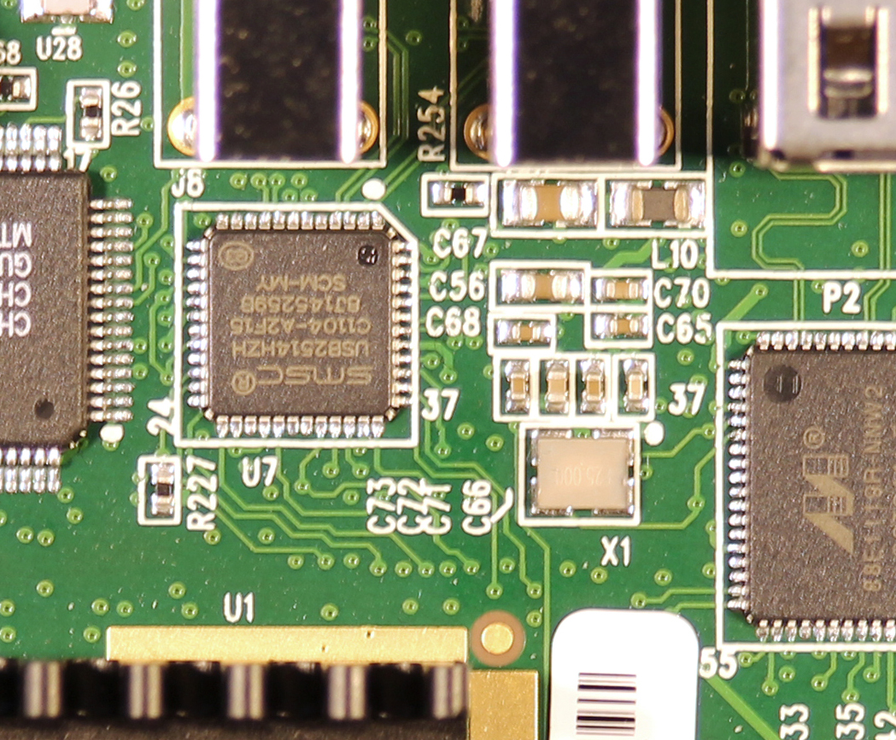
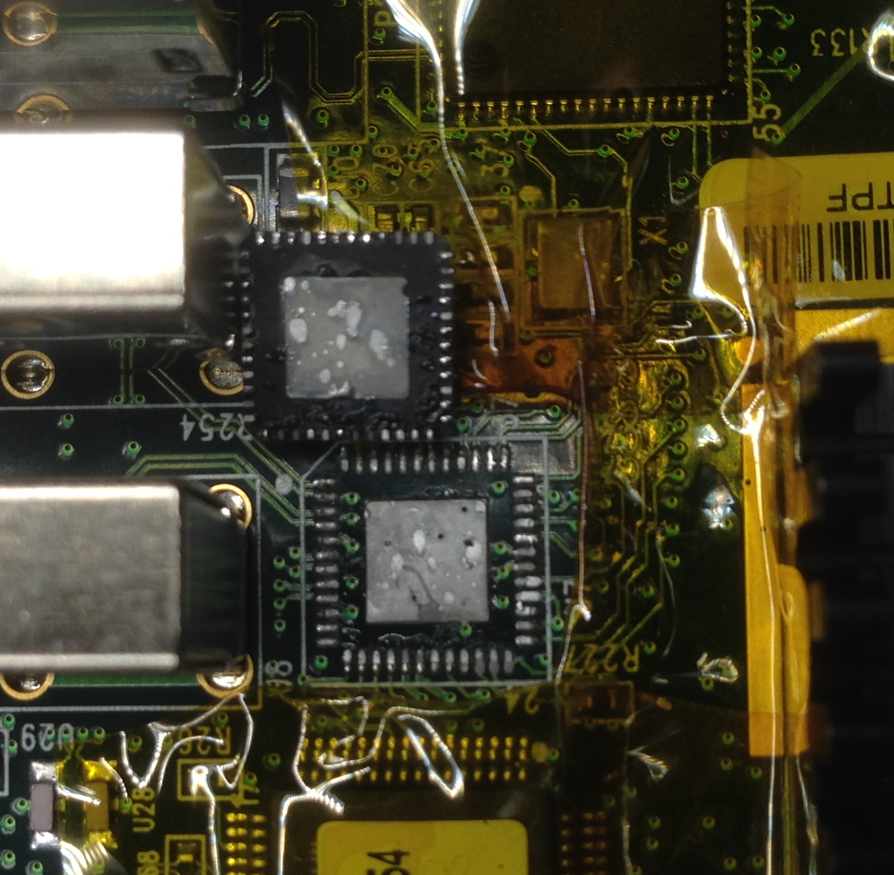
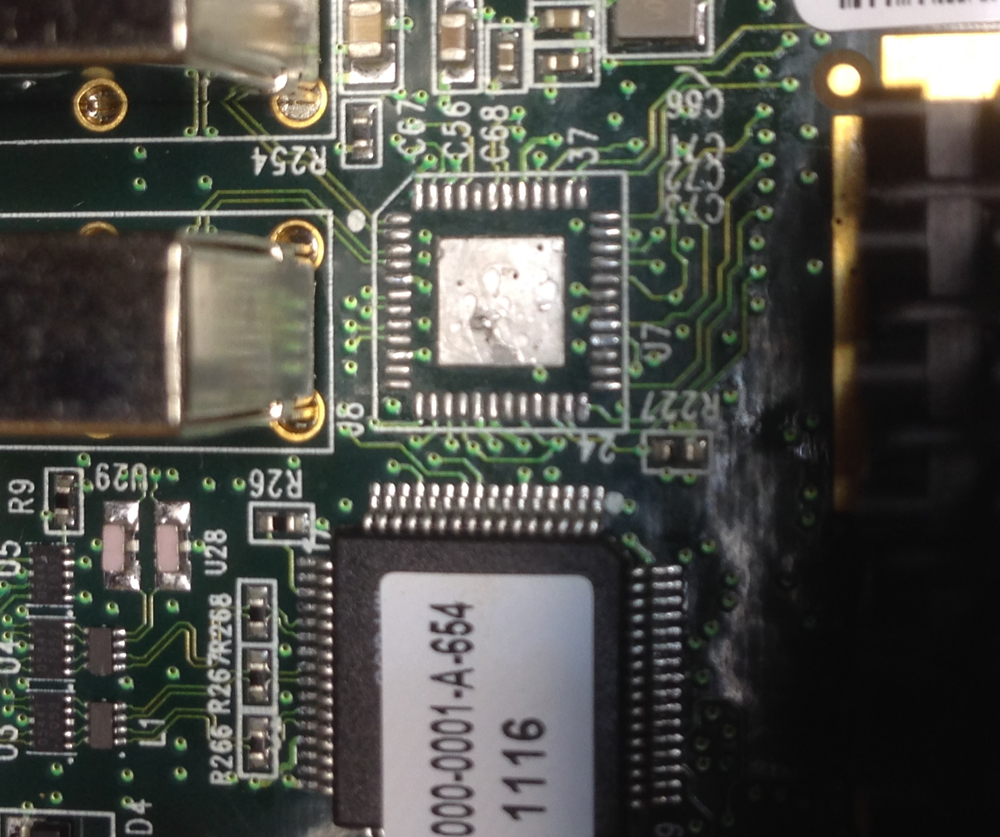

## Panologic based USB 2.0 Sniffer

This is a port of http://github.com/ultraembedded/usb_sniffer to the second 
generation Panologic thin client. 

If you don't know what a Panologic thin client then see [this](https://hackaday.com/2013/01/11/ask-hackaday-we-might-have-some-fpgas-to-hack/) 
article and refer to the links at the bottom of this page for further reading.

## Hardware differences from orignal project.

The usb_sniffer project was originally developed for the miniSpartan6+ board 
interfaced to an external USB3300.  The miniSpartan6+'s FT2232H USB interface 
was used to transfer captured data to a PC.  

The Panologic device is based on a larger device from the same Spartan 6 
family as the miniSpartan6+ and it already has a USB3300.  The Pano device 
doesn't have an FT2232H interface, but it does have gigabit Ethernet.

## Status

This project is in the planning stage. As you can see below the hardware is in 
the process of being modified but the modifications have not been completed yet.  

A skeleton project for the Pano has been created without the FT2232H interface. 
The project synthesizes and generates a bit file, but without an interface it's 
pretty useless.

It is my hope that this project will attract others that may be interested in
helping.

## Transferring captured data

Using the Ethernet port for communications will require a CPU core to run the 
networking stack, I plan on using a RISC V.  

If you are unfamiliar with the Pano hacking scene you may be about to put this 
project into the  "that'll never happen" category but fear not, two separate 
RISC V cores have already been used successfully on multiple Pano projects.

To speed initial development I plan on porting ultraembedded's command line 
program to run locally on RISC V and use a serial port for a console.

## HW Requirements

* A Pano Logic G2 (the one with a DVI port)
* A suitable 5 volt power supply
* A JTAG programmer to load the bitstream into the FPGA.
* A serial adapter compatible with 3.3v levels.

## HW Modifications

For this project it will be necessary to remove the USB hub chip that is 
between the USB3300 and the USB connectors. Once the hub chip is removed the 
USB3300's USB bus can be connect directly to two of the Pano's USB connectors.  
This will make it easy to insert the sniffer between a host and a peripheral.

The modified Pano will also be usable as a USB peripheral by loading 
appropriate HDL and software.

## HW Modification details

1. [Disassemble](https://tomverbeure.github.io/pano/logic/2018/12/02/Pano-Logic-G2-Disassembly.html) the Pano.
2. Mask everything around U7 with Kapton tape.
3. Remove the USB hub chip U7 using hot air gun.
4. Jumper USB data plus pins U7.2, U7.4, and U7.43.
5. Jumper USB data minus pins U7.1, U7.3, and U7.42.
6. Jumper USB VBUS enable U7.22 to U7.15.
7. Connect serial console Txd and Rxd to one of USB connectors next to the DVI
port (details TBD).
8. Create and adapter from the rewired USB connector to a 3.3v serial adapter
(details TBD).

Step 3 is the hardest part by far.  The USB2514 chip has a large thermal ground 
pad on the bottom of the chip which makes it difficult to remove.  A hot air gun
and lots of patience is required.  

I am NOT very experienced with a hot air gun but there may be people who find it 
easy! Additionally my hot air gun is an old ~$100 ebay special, but it did 
(eventually) get the job done.  

Here's our target:

 

After masking with Kapton tape:

 

After removing it:

 

After cleaning the pads and removing the tape:

 

The fact that the Pano still runs is a GOOD sign, stay tuned !

## Pano Links

- [Gitter](https://gitter.im/panologic/community) chat room for Panologic hackers.
- Group.io [group](https://groups.io/g/panohackers/topics) for discussions about Panologic hacking 
- [Original Hackaday](https://hackaday.com/2013/01/11/ask-hackaday-we-might-have-some-fpgas-to-hack/) article from 2013.  
- Hackaday article on Tom's [Raytracker](https://hackaday.com/2018/12/07/racing-the-beam-on-a-thin-client-in-fpgas/).  
- Hackaday article on my [Pacman](https://hackaday.com/2019/01/11/pac-man-fever-comes-to-the-pano-logic-fpga/) project.  
- Hackaday article on Tom's [Joystick adapter](https://hackaday.com/2019/02/11/two-joysticks-talk-to-fpga-arcade-game-over-a-vga-cable/).  
- Wenting Zhang's [VerilogBoy](https://github.com/zephray/VerilogBoy) project.
- Hackaday article on My [pano_progfpga](https://hackaday.com/2019/04/19/pano-logic-fgpa-hacking-just-got-easier/) project
- My [prog_fpga](https://github.com/skiphansen/pano_progfpga) project.
- My [pacman](https://github.com/skiphansen/pano_man) project.
- My [Hello World](https://github.com/skiphansen/pano_hello_g1) project.
- https://github.com/tomverbeure/panologic
- G1 [Schematics!](https://github.com/twj42/PanoLogicG2_ReverseEngineering/blob/master/files/G1_Schematics.zip)
- https://github.com/tomverbeure/panologic-g2
- https://twj42.github.io/PanoLogicG2_ReverseEngineering/

